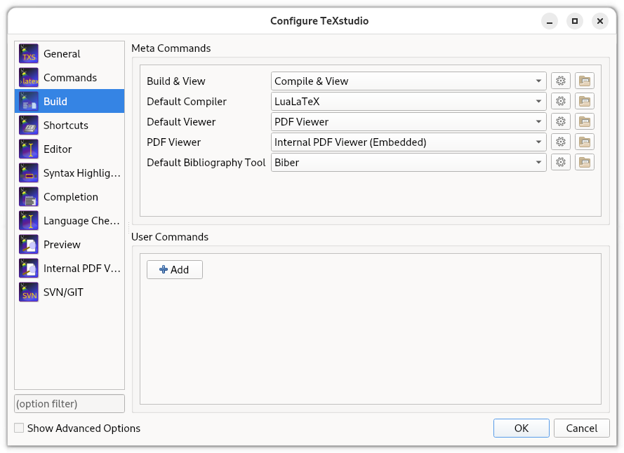

# My Kobe University Ph.D. thesis template

Two years ago, I submitted my thesis.
It is about to be published on the Kobe University repository.
To celebrate the occasion, I figured I would look back at the LaTeX sources and make it a template.

In my case, there are some rather [specific requirements](http://www.csi.kobe-u.ac.jp/current_students/degree/xdr_hyousi2_2022_11.pdf) set out by Kobe University and/or the Graduate School of System Informatics. These include a requirements on:
- what the cover page should look like
- the title page
- the copyright page

## Compiler

This template will compile with `LuaLaTeX`. To parse and generate the bibliography, I chose to use `biber`.

On the cover and title page of the thesis, there needs to be some amount of Japanese (Japanese title, name of the university).
When making my thesis, I used the `pdfLaTeX` compiler with package `CJK`, but found it rather difficult to install. I think using the `LuaLaTeX` compiler is the better option.

If you are using _TeX Studio_, these settings can be changed by opening the _Options > Configure TeXstudio_ menu, opening the _Build_ tab and adjusting the compiler and bibliography tool as shown below:

## A few explanations

The base class used for this template is the standard "book" class. I made a number of small customizations to make the document more to my liking.

The geometry is adjusted to make the inside margin wider. When looking at the PDF pages this may look weird at first glance, but once in a binder or printed in a soft-cover book, this will be just fine.

I made the document so that all chapters always start on a right page. This means that if the preceding chapter ends on a right page, there is going to be an empty left page before the new chapter. This is not an issue, but by default, the headers and the page numbers of the previous chapter are still printed. The commands after [line 44](thesis.tex#L44) make it so that those empty pages are entirely blank.

Through the use of package `hyperref`, the references, URLs, and citations are all clickable, as well as the page numbers in the Table of Contents.
A number of bookmarks have been added manually.
The metadata of the PDF generated should contain appropriate information based on the contents written in the `\title{}` and `\author{}` commands.

## Structure

Parts automatically generated are in italic.

- _Cover page_
- Frontmatter
  - _Title page_
  - Dedication
  - Abstract [0-frontmatter/abstract.tex](0-frontmatter/abstract.tex)
  - Acknowledgment [0-frontmatter/acknowledgment.tex](0-frontmatter/acknowledgment.tex)
  - _Table of Contents_
  - _List of Figures_
  - _List of Tables_
  - _Listings_
- Mainmatter
  - Chapter 1 [1-introduction/introduction.tex](1-introduction/introduction.tex)
  - ...
  - _Bibliography_ Automatically generated based on the contents of [bibli.bib](bibli.bib)
  - Appendix A [A-appendix](A-appendix/sourcecode.tex)
  - ...
  - List of publications [Z-publications/publications](Z-publications/publications.tex)
  - _Copyright notice_

The Cover and the Title page are automatically generated based on the contents given to the [`\title{}` and `\author{}` commands as well as a number of other commands](thesis.tex#L105).
These command are also used to automatically record metadata within the document.

My thesis had a significant number of Listings, and I chose to include their after the List of Tables. You may not need this, or you may prefer the Algorithm environment. Either case, the adjustments should be trivial.
The settings used for the Listings can be found at [line 81](thesis.tex#L81). The call to make the _Listings_ page is after [line 254](thesis.tex#L254).

## Checking compliance with the PDF/A standards

According to the requirements set out by the graduate schoo, the generated PDF needs to be PDF/A compliant, but it doesn't actually specify which version of the standard to use.
At any rate, this template will produce a PDF/A-3B compliant file, which may or may not be the standard expected by your graduate school.
You can use a tool such as [veraPDF](https://docs.verapdf.org/install/) to check that the PDF produced is compliant.
